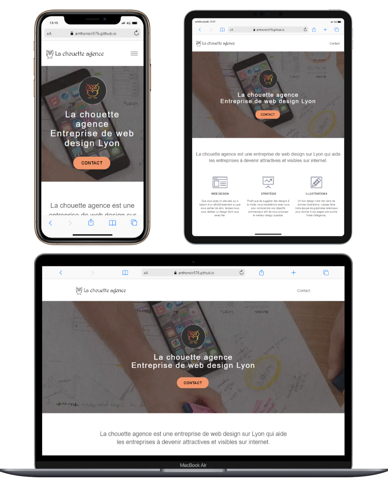

# OpenClassrooms P4 

## Optimisez un site web existant :

## Objectifs :
L'objectif est d'analyser et d'optimiser (SEO et accessibilité) le site web déjà existant de l'agence web "La Chouette Agence". Puis comparer les 2 versions du site.

## Livrables :
- Une analyse du SEO
- Une liste de 10 recommandations SEO
- Le code source complet du site amélioré
- Un rapport d’optimisation comprenant une comparaison des résultats

## Connaissances évaluées :
- SEO naturel
- SEO grâce aux performances techniques
- Accessibilité

## À FAIRE :

- ✅ <del>Idées d'optimisation</del>
- ❌ Réviser les cours SEO - ACCESSIBILITE 
- ❌ Commencez l'optimisation  
- ❌ Finir RAPPORT
- ❌ Finir RECOMMANDATION 
- ❌ Finir ANALYSE 

- ❌ Finir BROUILLON
